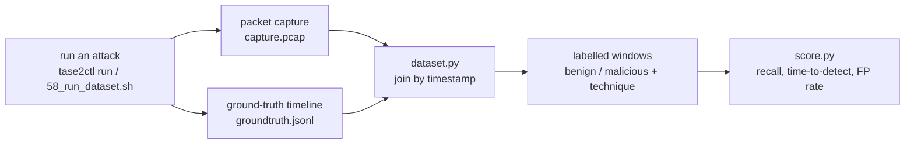
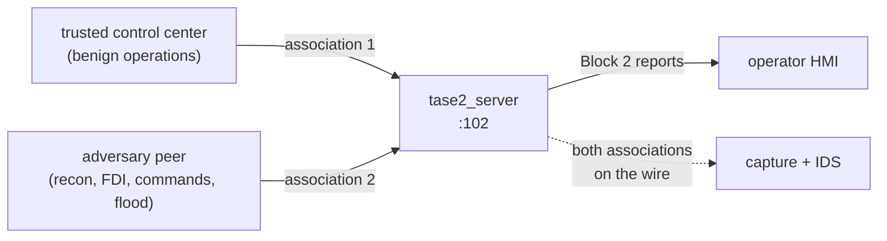

# The attack library

These are built-in, multi-stage attacks on the grid, written to look on the wire
the way a real intrusion would, so you can capture them, label them, and build and
test detections against traffic that resembles the real thing. Each one is grounded
in a documented incident or a recognised technique, each step is tagged with its
MITRE ATT&CK for ICS identifier (the classic T08xx series), and each runs on the
live power-flow grid so the consequences are physically consistent. Every run also
writes a ground-truth timeline, so every packet window is labelled.

This guide explains each attack and, just as important, what to look for in the
TASE.2 traffic to detect it.

## Run one, and capture it

```bash
python3 suite/tase2ctl.py run ukraine2015-attack
```

To turn it into a labelled dataset and a detection score:

```bash
sudo SCENARIO=scenarios/ukraine2015_blackout.json ./scripts/58_run_dataset.sh
./scripts/59_score.sh datasets/<run>
```

The four headline attacks are also deployments in the control console under Attack
Scenarios: `ukraine2015-attack`, `industroyer-attack`, `stealthy-attack`, and
`recon-attack`.

That single run is the whole pipeline: the attack plays as real traffic, the engine
writes a ground-truth timeline beside the capture, and the two are joined into a
labelled dataset you can score a detector against.



## The attacker is a separate peer

What makes this traffic realistic is that the attack does not come from the trusted
feed. Benign operations arrive on the normal association; the recon reads, false
data, unauthorized commands, and floods arrive on a second association from a
separate peer, exactly the way a real intrusion looks on the wire. The ground truth
records which association each event came from, so a detector can be graded on
whether it told the two apart.



## Two environments: simple or realistic

Every attack runs on either of two environments, and you pick which when you launch
it. An attack does not name fixed points; it names them by role (the tie breaker,
the tie flow, a bus voltage, a feeder breaker, the communications station). An
environment maps each role to a real point and supplies the grid behind it, so the
same attack plays out on either grid without being rewritten:

- **simple** is the original four-bus teaching grid: one tie, two feeders, a
  transformer. Small and legible, best for seeing an attack's mechanics on one
  screen.
- **realistic** is the regional grid behind `grid-demo`: two generation plants, a
  345 kV backbone, four 138 kV load substations, two external ties, and around 110
  points with the full telemetry taxonomy. Opening the Central-East tie triggers a
  real multi-substation cascade. Best for showing an attack the way an operator
  would actually see it.

In the control console each Attack Scenario slot has an environment dropdown next to
its Start button. From the command line, pass `--env`:

```bash
python3 suite/tase2ctl.py run ukraine2015-attack --env realistic
```

The environment is defined in `config/environments.json`; to add one, give every
role an entry there. Both environments are tuned so the grid is stable at rest and
the scripted tie opening tips it into a cascade, so the headline blackout lands on
either grid.

## How to read TASE.2 traffic

TASE.2 / ICCP is MMS (ISO 9506) carried over TPKT, COTP, the OSI session and
presentation layers, and ACSE, on TCP port 102. To read an
attack you watch a small number of MMS operations, and the object names that appear
as plain ASCII inside the PDUs tell you what is being touched. See
{doc}`tase2-on-the-wire` for the framing in detail. The operations that matter:

- **Association** (MMS Initiate, carried in an ACSE AARQ/AARE). A new TCP connection
  and association is a new peer arriving.
- **Read** of a named variable. A client reading object values. The object name is in
  the request: an indication point such as `plc1_mw`, a control object `plc1_brk_ctl`,
  or a metadata object such as `TASE2_Version`, `Supported_Features`,
  `Bilateral_Table_ID`, or `Next_DSTransfer_Set`.
- **Write** of a named variable. The command and injection direction:
  - to an indication point member, `plc1_mw$Value`, `plc1_mw$Flags` (the quality
    byte), or `plc1_mw$TimeStamp`, is a value injection or quality manipulation;
  - to a control object member, `plc1_brk_ctl$Command`, `plc1_brk_ctl$SBO` (select),
    or `plc1_brk_ctl$Tag`, is a Block 5 operate or select;
  - to a `DSTransferSet01` member is Block 2 transfer-set configuration.
- **InformationReport** (unconfirmed). The server pushing Block 2 telemetry to a
  subscribed client. These flow server to client and carry the point values, quality,
  and time tags.
- **defineNamedVariableList** / **deleteNamedVariableList**. A client creating or
  removing a data set, normally as part of subscribing.

Three lenses make the rest of this guide concrete:

- **Direction.** Client-to-server writes are commands and injections; server-to-client
  InformationReports are telemetry. The dataset records this per window as
  `pkts_c2s` / `pkts_s2c` and a protocol-aware `mms_pdus` count.
- **Object name.** A `_ctl` suffix means a control object. A `$Command` or `$SBO`
  write is a command or a select. A write to `Bilateral_Table_ID` being *read* is
  discovery. The names are not hidden; they are in the PDU.
- **Which association.** The single strongest signal across every attack here is a
  second association that behaves unlike the trusted feed: it reads objects it has no
  need to, writes to control objects, or sends at an inhuman rate. The scenarios put
  the attack traffic on its own association on purpose, so you can practise keying on
  exactly that.

To pin each step in this chain to the exact packet, the ground-truth timeline records
every event with a microsecond `utc` timestamp that sits on its PDU. Match it against
Wireshark's UTC clock as described in
{doc}`scenarios`, under "Correlating an event with the exact packet".

## The scenarios

### ukraine2015-attack (`scenarios/ukraine2015_blackout.json`)

**What it is.** The December 2015 attack on the Ukrainian grid, the first cyberattack
publicly confirmed to cause a blackout, attributed to Sandworm using BlackEnergy3.
Having stolen operator credentials, the adversary used the utility's own SCADA to open
breakers at around thirty substations, then wiped HMIs, bricked serial-to-Ethernet
converters, and ran a telephone denial of service so operators could neither see nor
respond.

**On the wire.** A second association appears and issues a sweep of MMS Reads (first
the metadata objects, then every indication point). Then a burst of MMS Writes to
control objects: for each breaker, `plc1_brk_ctl$SBO` = 1 (select) immediately followed
by `plc1_brk_ctl$Command` = 0 (open), across `plc1_brk_ctl`, `plc2_brk_ctl`, and
`rtu1_brk_ctl` within a few seconds. Then a rapid repeated `plc1_brk_ctl$Command` write
loop (the re-open flood). Finally the `plc3` indication points stop appearing in
InformationReports and arrive with NOT-VALID quality.

**Indicators to look for.**

- Writes to any `*_ctl$Command` from an association that is not the trusted control
  center. Commands should originate only from a known source; a command from a new
  peer is the headline event (T0855).
- Several distinct breaker control objects commanded within one short window. A human
  operator opens one breaker deliberately; a coordinated multi-breaker open is not
  operator behaviour (T0831).
- The commanded value is 0 (open) on breaker controls, the de-energising direction.
- A high write rate to a single control object, the re-open loop. Operators do not spam
  a breaker; a burst of `$Command` writes to one object is denial of control (T0813).
- A telemetry gap or a flip to NOT-VALID quality on a station's points right after the
  commands. InformationReports for `plc3` stop or carry NOT-VALID, the loss-of-view
  signal (T0815).

### industroyer-attack (`scenarios/industroyer_sweep.json`)

**What it is.** The December 2016 attack on a Kyiv transmission substation by
Industroyer, also called CRASHOVERRIDE (MITRE campaign C0025, software S0604), the
first malware purpose-built to speak grid protocols directly. Its modules drove
IEC 60870-5-101/104, IEC 61850, and OPC to change breaker and switch state, sweeping
them and rapidly toggling state.

**On the wire.** An immediate discovery read burst on association, a Write to
`plc1_mw$Value` that pins a constant calm value, a tight sweep of `*_ctl$Command` = 0
writes across the breakers, and then a high-frequency alternating
`plc2_brk_ctl$Command` 0 / 1 / 0 / 1 toggle at many PDUs per second.

**Indicators to look for.**

- Discovery-then-act timing: a new association that reads the model and within seconds
  begins writing to control objects. Legitimate clients associate, subscribe, and
  settle; they do not read-then-command immediately (T0888 into T0855).
- A control object commanded at high frequency, the toggling loop. This is a rate
  signature: legitimate control is sparse and human-paced, so more than a handful of
  `$Command` writes per second to one object is anomalous (T0814). The dataset
  `mms_pdus` count per window spikes here, which makes it easy to threshold.
- A short burst of control writes to several breaker objects, the sweep (T0855).
- An indication point `$Value` written to a fixed number while its correlated points
  keep moving. A value that stops tracking its neighbours is manipulation of view
  (T0832).

### stealthy-attack (`scenarios/stealthy_false_data.json`)

**What it is.** The quiet attack, and the one signatures struggle with. There is no
breaker open and no obvious command. The adversary identifies the controllable
parameters, nudges a setpoint to push toward instability, then feeds false telemetry so
the developing problem stays hidden: the tie-line flow reads normal while it really
climbs, and the transformer oil temperature is held below its alarm limit while it
really heats.

**On the wire.** A few targeted Reads (point identification), a Write to
`plc1_avr_ctl$Command` (a float setpoint), then Writes to `plc1_mw$Value` and
`plc3_temp$Value` that hold flat values while the physics-driven truth diverges.

**Indicators to look for, and why this one is hard.** A single `$Value` write is
byte-for-byte the same kind of message the trusted gateway sends every cycle, so a
content signature cannot separate the spoof from a normal update. You have to look
behaviourally:

- A write to a setpoint control object (`*_avr_ctl$Command`) from an association that is
  not the operator. A parameter change nobody at the console initiated (T0836).
- A `$Value` whose value contradicts correlated points: the tie flow flat while bus
  voltage and breaker state change. This is a physical-consistency or cross-correlation
  check, not a signature (T0856, T0832).
- A measurement pinned just below its alarm threshold while related stress indicators
  rise, the alarm-suppression tell (T0878).
- The same point written by two associations in the same period: the gateway and the
  attacker both writing `plc1_mw$Value` is a duplicate-writer signal.
- Values that are out of plausible range given the rest of the grid model.

This is the case for value-range and physics-aware detection rather than content rules,
and the scorecard will show signature rules missing it, on purpose.

### recon-attack (`scenarios/recon_collection.json`)

**What it is.** The stage before the impact, and a clean detection target on its own. An
attacker with a foothold reads the model and the bilateral table, re-reads every point
over time, and singles out the breakers, without sending a single command. Nothing
changes physically, which is exactly what makes catching it valuable: stopping the
attack here means stopping it before a breaker ever moves.

**On the wire.** A new association, then MMS Reads of the metadata objects
(`TASE2_Version`, `Supported_Features`, `Bilateral_Table_ID`, `Next_DSTransfer_Set`),
then Reads sweeping every indication point, repeated at intervals, plus Reads of the
`*_ctl` control objects. No writes, no subscription.

**Indicators to look for.**

- A peer reading `Bilateral_Table_ID`, `Supported_Features`, or `Next_DSTransfer_Set`.
  Operational peers negotiate these once at association; a peer reading them, especially
  repeatedly, is enumerating the node (T0888).
- Read coverage spanning the whole namespace, many distinct object names, rather than
  the handful of points a real client uses (T0801).
- Periodic full-model read sweeps at a steady cadence, the rhythm of automated
  collection (T0802).
- Reads of `*_ctl` control objects by a peer that never operates them, identifying what
  is controllable (T0861).
- A high read-to-write ratio with no transfer-set subscription. A normal SCADA client
  subscribes and then receives reports; a peer that only reads, broadly and repeatedly,
  is browsing, not operating.

## Turning the indicators into detections

The pipeline is built to practise exactly this. Capture and label a run with
`scripts/58_run_dataset.sh`; each one-second window then carries the features that
expose the indicators above: `pkts_c2s` and `pkts_s2c` (the command-versus-telemetry
balance), `mms_pdus` (the protocol-aware PDU count that catches floods and read
sweeps), `max_len`, and the TCP flag counts, alongside the benign-or-malicious label
and the technique tag.

Write or tune rules against that, then grade them with `scripts/59_score.sh`. The
starter Suricata rules in `detect/` show the split clearly: a rule keying on a write to
`_ctl` with a `Command` member catches the command attacks (ukraine2015, industroyer)
well, while the false-data injection in the stealthy scenario slips past it, because a
spoofed `$Value` write looks like a legitimate one. The scorecard reports that gap per
technique, which is the honest starting point for deciding where to add value-range or
physics-aware detection. See {doc}`datasets` and {doc}`scoring`.

## Building your own

Copy one of these and edit the timeline. Keep `"attacker": true` so the malicious
traffic comes from its own association, tag each step with its ATT&CK for ICS technique
so the dataset and scorecard stay meaningful, and point the scenario at a grid so the
consequences are physical. Validate it, then capture and score it like any other run.
See {doc}`scenarios` for the full action vocabulary.

## Sources

The incident details above are drawn from public analyses and the MITRE ATT&CK for ICS
knowledge base: the 2015 Ukraine power grid attack and the 2016 Industroyer /
CRASHOVERRIDE campaign (MITRE C0025, software S0604). The technique identifiers are the
classic ATT&CK for ICS T08xx series, the set most ICS detection work references.
