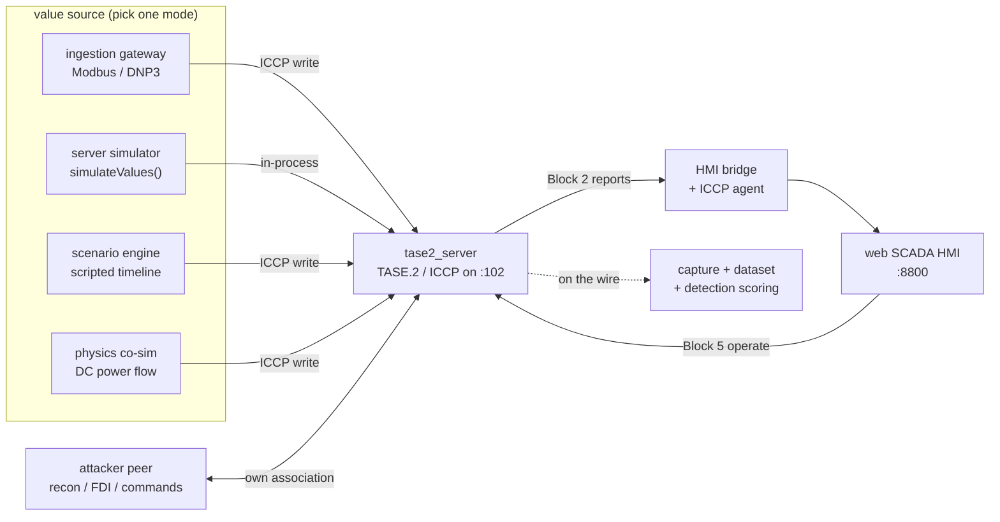

# Architecture summary

## The whole picture

One TASE.2 server sits at the center. What drives its points changes with the
operating mode (a field gateway, the built-in simulator, a scripted scenario, or a
power-flow co-simulation), but everything downstream of the server, the ICCP
reporting, the HMI, the capture and detection tools, is identical. That is the point
of the design: swap the value source, keep the protocol path real.



## Field data flow

In ingestion mode the value source is real field equipment, and data moves in two
directions through the gateway:

```text
                         monitoring (read up)
 PLC / RTU  ─ Modbus  ─▶ tase2_ingest ─ ICCP write ─▶ tase2_server ─ ICCP report ─▶ HMI
 (Modbus or            (the gateway)                 (TASE.2 publisher)            (web SCADA)
  DNP3)     ◀─ Modbus ─ tase2_ingest ◀─ ICCP read ── tase2_server ◀─ ICCP operate ─ HMI
   or DNP3              command (write down)
```

Two directions:

1. **Monitoring (upstream).** The gateway polls each device, scales the raw value
   into engineering units, and writes it into the server's point with a quality
   byte (valid or not-valid) and a time tag. The server publishes the point over
   ICCP. The bridge subscribes and the HMI shows it.
2. **Control (downstream).** An operator command on the HMI becomes a TASE.2
   Block 5 operate on the point's control object. The gateway reads that command
   over ICCP and writes it down to the device (a Modbus write or a DNP3 CROB). The
   device acts and the new state is read back up. Command and read-back are
   different objects, so control never fights the monitoring updates.

## Components

| Component | Path | Role |
|-----------|------|------|
| TASE.2 server | `src/tase2_server.c` | Publishes the point model, reports, accepts control |
| ICCP agent | `src/tase2_hmi_agent.c` | Persistent MMS client used by the bridge and gateway |
| Ingestion gateway | `ingest/tase2_ingest.py` | Modbus and DNP3 masters; polls up, commands down |
| HMI bridge | `hmi/bridge.py` | Subscribes over ICCP, serves the web HMI and control API |
| Web HMI | `hmi/static/` | Dynamic station grid, alarms, event log |
| DNP3 outstation simulator | `ingest/dnp3_outstation_sim.py` | Bench target for the DNP3 path |
| Point model | `config/scada.json` | Stations, points, controls |
| Tag database | `ingest/tags*.json` | Maps each point to a field register or DNP3 index |

## Operating modes

The node is one tool with explicit modes, not separate builds:

- **Value source.** Simulation (synthetic values from the server) for training and
  capture, ingestion (real field data via Modbus or DNP3), scenario (a scripted,
  labelled timeline, see {doc}`../guides/scenarios`), or physics (a power-flow grid
  model whose solved state drives the points, see {doc}`../guides/physics`).
- **Security profile.** `insecure` (plaintext, open command path) for attack demos,
  or `hardened` (mutual TLS plus a command allowlist) for defense testing. See
  {doc}`../guides/configuration`.

```{warning}
The simulation mode connects to nothing and is safe for an open lab. The ingestion
mode reaches real devices. Keep them on segmented networks and never point a
synthetic build at real infrastructure. The active mode is logged at startup and
shown in the HMI.
```

## Limitations

- Common TASE.2 object encodings with quality and time tags, not the full
  IEC 60870-6-802 catalogue.
- Quality is summarised to validity and source bits, not a full pass-through of a
  device's native quality.
- The point model is read at startup; adding a station needs a restart.
- Redundancy, failover, and large-scale sizing are not implemented. See
  {doc}`../resources/roadmap`.
